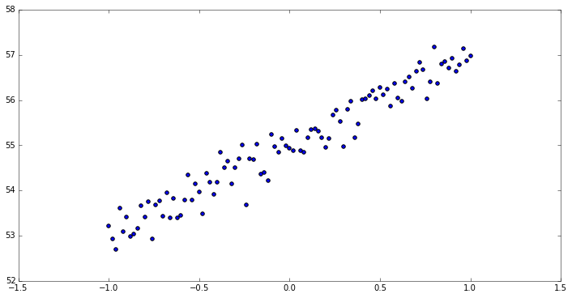
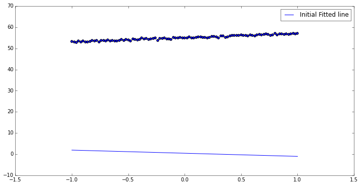

## Linear Regression


```python
%matplotlib inline
import matplotlib.pyplot as plt
import numpy as np
import tensorflow as tf
```

```python
# Parameters
learning_rate = 0.01
training_epochs = 200
display_step = 10
```


```python
# Training Data
train_X = np.linspace(-1, 1, 101)
train_Y = train_X * 2 + np.random.randn(*train_X.shape) * 0.3 + 2 * np.random.rand() * train_X.shape[0]
```


```python
# Model

# placeholder nodes
x = tf.placeholder(tf.float32, shape=(None,), name="x")
y = tf.placeholder(tf.float32, shape=(None,), name="y")

# weight node
W = tf.Variable(np.random.randn(), name="Weight")
b = tf.Variable(np.random.randn(), name="Bias")

# prediction/output node
y_pred = tf.add(tf.mul(W, x), b)
```


```python
# initialize variables
init = tf.initialize_all_variables()

# define a cost function (MSE)
cost = tf.reduce_mean(tf.square(y_pred - y))

# define optimization process
optimizer = tf.train.GradientDescentOptimizer(learning_rate=0.1)
train_op = optimizer.minimize(cost)

# log format
log_str = "Epoch: {:03d} cost={:.10f} W={:.9f} b={:.9f}"
```


```python
with tf.Session() as sess:
    sess.run(init)
    
    # prediction before training (using the initialized weight)
    pred_Y_init = sess.run(y_pred, {x: train_X})
    
    for epoch in range(training_epochs):
        cost_t, W_t, b_t, _ = sess.run([cost, W, b, train_op],
                                   feed_dict = {x: train_X, y: train_Y})
        if epoch % display_step == 0:
            print log_str.format(epoch+1, cost_t , W_t, b_t)
    
    # prediction after training
    pred_Y_final = sess.run(y_pred, {x: train_X})
```

    Epoch: 001 cost=2983.6848144531 W=-1.241035223 b=11.337662697
    Epoch: 011 cost=35.4467506409 W=0.404614896 b=50.316410065
    Epoch: 021 cost=0.7257039547 W=1.218375444 b=54.501720428
    Epoch: 031 cost=0.1468540430 W=1.620773315 b=54.951114655
    Epoch: 041 cost=0.0965219438 W=1.819755793 b=54.999366760
    Epoch: 051 cost=0.0852662846 W=1.918151021 b=55.004554749
    Epoch: 061 cost=0.0825262293 W=1.966806531 b=55.005104065
    Epoch: 071 cost=0.0818564072 W=1.990866423 b=55.005165100
    Epoch: 081 cost=0.0816923901 W=2.002763748 b=55.005165100
    Epoch: 091 cost=0.0816525072 W=2.008646727 b=55.005165100
    Epoch: 101 cost=0.0816427171 W=2.011556149 b=55.005165100
    Epoch: 111 cost=0.0816402733 W=2.012995005 b=55.005165100
    Epoch: 121 cost=0.0816397443 W=2.013706207 b=55.005165100
    Epoch: 131 cost=0.0816394910 W=2.014057875 b=55.005165100
    Epoch: 141 cost=0.0816395283 W=2.014231443 b=55.005165100
    Epoch: 151 cost=0.0816393942 W=2.014317751 b=55.005165100
    Epoch: 161 cost=0.0816395059 W=2.014360428 b=55.005165100
    Epoch: 171 cost=0.0816394687 W=2.014381409 b=55.005165100
    Epoch: 181 cost=0.0816394985 W=2.014391661 b=55.005165100
    Epoch: 191 cost=0.0816394985 W=2.014396906 b=55.005165100


```python
# raw data plot
plt.rc('figure', figsize=(12,6))
plt.scatter(train_X, train_Y)
plt.show()
```





```python
# prediction plot before training (using the initialized weight)
plt.rc('figure', figsize=(12,6))
fig = plt.figure(1)
plt.scatter(train_X, train_Y)
plt.plot(train_X, pred_Y_init, label='Initial Fitted line')
plt.legend(loc=0)
plt.show()
```





```python
# prediction plot after training
plt.rc('figure', figsize=(12,6))
plt.figure(1)
plt.scatter(train_X, train_Y)
plt.plot(train_X, pred_Y_final, label="Final Fitted Line")
plt.legend(loc=0)
plt.show()
```


